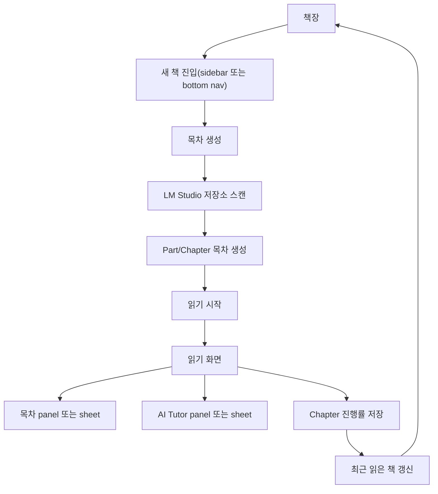

# Apple Books형 Repo Books 와이어프레임

## 구조 요약

Repo Books는 GitHub 저장소를 책으로 변환해 읽는 ebook 앱이다. 사용자는 저장소 URL을 계속 다루지 않고, 책장에서 책을 고르고 reader에서 읽는다. 새 저장소 변환은 책장 sidebar 또는 모바일 bottom navigation의 `새 책` 진입으로 처리한다.

- Mac: 좌측 sidebar + 최근 읽은 책 shelf + 내 책 cover grid.
- iPad/iPhone: Home/Library 중심의 단일 컬럼 + bottom navigation + bottom sheet.
- 목차 생성: 저장소 입력, LM Studio 설정, 생성된 Part/Chapter 목차 확인.
- 읽기: 좌측 목차, 중앙 book page, 우측 AI Tutor 여백. 좁은 화면에서는 목차와 AI가 bottom sheet로 열린다.

## Mac 와이어프레임

```text
+----------------------------------------------------------------------------------+
| Repo Books                                             LM Studio ready            |
+----------------------+-----------------------------------------------------------+
| Library              | Home                                                      |
| - 홈                 |                                                           |
| - 최근 읽은 책        | 최근 읽은 책                                                |
| - 내 책              | [cover + current chapter] [cover + current chapter]         |
| - 컬렉션             |                                                           |
| - 생성 중            | [전체] [읽는 중] [생성 중] [초안]                            |
|                      |                                                           |
| + 새 책 만들기        | 내 책                                                       |
|                      | [cover] [cover] [cover] [cover]                             |
|                      | title   title   title   title                               |
+----------------------+-----------------------------------------------------------+
```

## iPad 와이어프레임

```text
+---------------------------------------------------------------+
| Repo Books                                      LM Studio ready |
+---------------------------------------------------------------+
| Home                                                          |
| 최근 읽은 책                                                   |
| [wide cover]                                                  |
| [wide cover]                                                  |
|                                                               |
| [전체] [읽는 중] [생성 중] [초안]                              |
|                                                               |
| 내 책                                                          |
| [cover] [cover] [cover]                                       |
+---------------------------------------------------------------+
| 책장                     새 책                         읽기     |
+---------------------------------------------------------------+
```

## iPhone 와이어프레임

```text
+---------------------------------------+
| Repo Books              LM ready       |
+---------------------------------------+
| Home                                  |
| 최근 읽은 책                           |
| [cover + chapter]                     |
| [cover + chapter]                     |
|                                       |
| [전체] [읽는 중] [생성 중] [초안]      |
|                                       |
| 내 책                                  |
| [cover] [cover]                       |
| [cover] [cover]                       |
+---------------------------------------+
| 책장            새 책            읽기   |
+---------------------------------------+
```

## 목차 생성 와이어프레임

```text
+----------------------------------------------------------------------------------+
| 책장으로 돌아가기                  목차 생성                         읽기 시작     |
+----------------------------------------------------------------------------------+
| 저장소 URL/경로 입력                                                               |
| LM Studio 모델 / 독자 수준 / 생성 깊이                                             |
|                                                                                  |
| 분석 진행 상태                      생성된 책 목차                                  |
| [scan -> toc -> chapter]            Part 1. 시작하기                               |
|                                     - 1.1 저장소가 해결하는 문제                    |
|                                     - 1.2 폴더를 대단원으로 바꾸기                   |
|                                     Part 2. 핵심 흐름 읽기                           |
+----------------------------------------------------------------------------------+
```

## 읽기 와이어프레임

```text
+----------------------+--------------------------------------+--------------------+
| 목차                  | Chapter 1.2                         | AI Tutor           |
| Part 1                | 폴더를 대단원으로 바꾸기              | 현재 장에 대해 질문  |
| - 1.1                 |                                      | 추천 질문           |
| - 1.2 current         | 본문 / 코드 앵커 / 체크포인트          | 답변 스트림          |
| 관련 파일              |                                      |                    |
+----------------------+--------------------------------------+--------------------+
| 이전 장        목차        보기 설정        AI 열기        다음 장                  |
+----------------------------------------------------------------------------------+
```

## 동작 플로우



## 와이어프레임 보조 설명

- LM Studio 상태: 책장 상단에는 연결 여부만 작게 표시한다. 모델명, context, 파일 색인 수는 목차 생성 화면의 runtime panel에서 보여준다.
- 생성 진행/실패: 책장에서는 생성 중 책을 하나의 책 카드로 보여준다. 실패 시 부분 목차를 보존하고 목차 생성 화면에서 재시도한다.
- 최근 읽은 책 정렬: 마지막으로 연 책이 가장 앞에 온다. 카드에는 현재 Chapter, 마지막 열람 시각, 진행률만 노출한다.
- AI Tutor 패널: desktop에서는 읽기 화면 우측 inspector, mobile에서는 하단 sheet로 열린다. 채팅이 본문을 대체하지 않고, 본문을 읽는 중 질문하는 보조 창구로 유지한다.
- 모바일 bottom sheet: 목차와 AI 패널은 하단 reading controls 위로 올라온다. 닫으면 단일 컬럼 본문으로 복귀한다.
- 새 책 만들기: desktop에서는 sidebar의 `+ 새 책 만들기`, mobile/tablet에서는 bottom navigation의 `새 책`으로만 진입한다.
